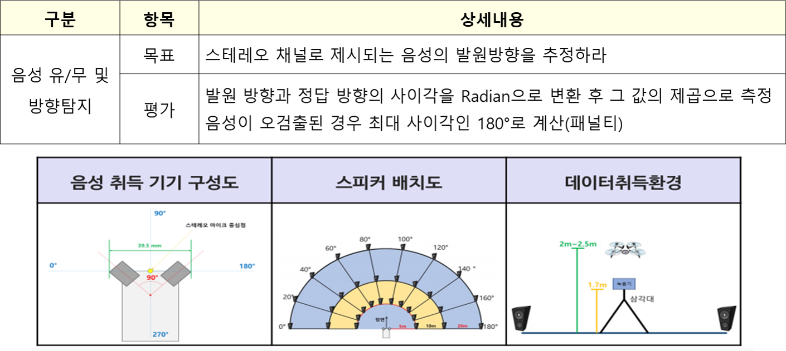

## 2019 그랜드 챌린지 청각인지 (track3) 데이터셋 (GIST)
### 과제 개요 (2019 Grand Challenge 개요)

* <u>드론 장비</u>를 활용한 음성/음향 기반 재난 대응 관련 연구
  - 드론으로 취득된 음성정보에서 구조요청 소리를 듣고 발생 위치 추정

### DB 상세 내용
* 구조 음성(성인남녀 및 소아남녀) 및 비음성(개짖는소리, 차경적소리)을 스피커에서
재생하여 마이크에서 수집
*  실외에서 호버링 중인 드론 하단에 삼각대를 이용하여 지면과 수평이 되도록 고정시킨
스테레오 마이크를 통해 오디오 신호 녹음
* 수집 환경
  - 녹음 장비 : Sony PCM-A10
  - 각도 : 스테레오 마이크의 중심점 기준 20도 간격(0~180도)
  - 거리 : 스테레오 마이크 중심점 지면 위치 기준 5m, 10m, 20m
  - 비행 고도 2m~2.5m 상태 호버링 
  - 녹음장소 : 야외 공터
* 오디오 규격
  - Stereo, bit/48kHz로 녹음된 1초 이상의 길이제한이 없는 오디오클립
  - 수량 :  500개

# Contributors
* 김홍국 (hongkook@gist.ac.kr, GIST, 교수)
* 김남균 (skarbs001@gist.ac.kr, GIST, 박사과정)
* 이정혁 (ljh0412@gist.ac.kr, GIST, 박사과정)
* 
* 이건우 (geonwoo0801@gist.ac.kr, GIST, 박사과정)
* 박동건 (dongkeon@gist.ac.kr, GIST, 통합과정)

# Acknowledgement
This work was supported by Institute of Information & communications Technology Planning & Evaluation (IITP) grant funded by the Korea government(MSIT) (No. 2019-0-01767, Development of Machine Learning-Based Acoustic Intelligence Technology for Disaster Response Using Drones)
